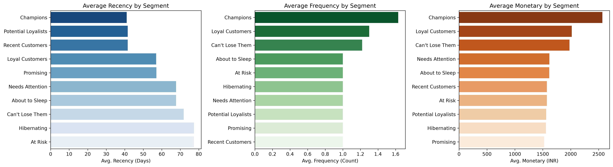
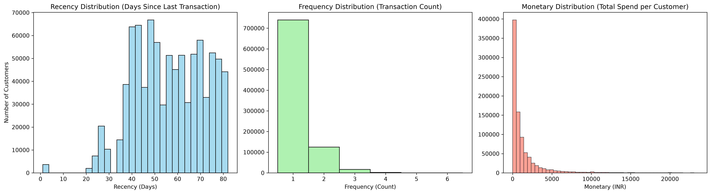
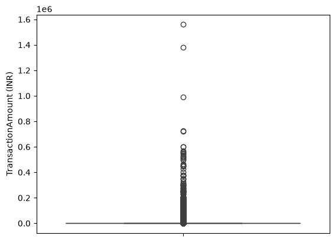
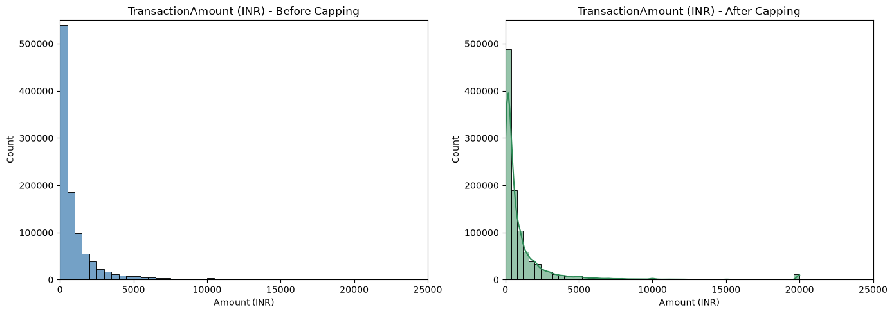
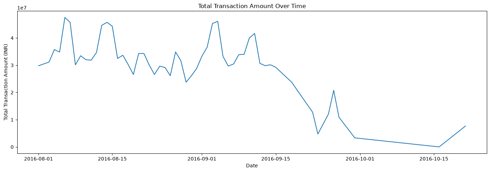
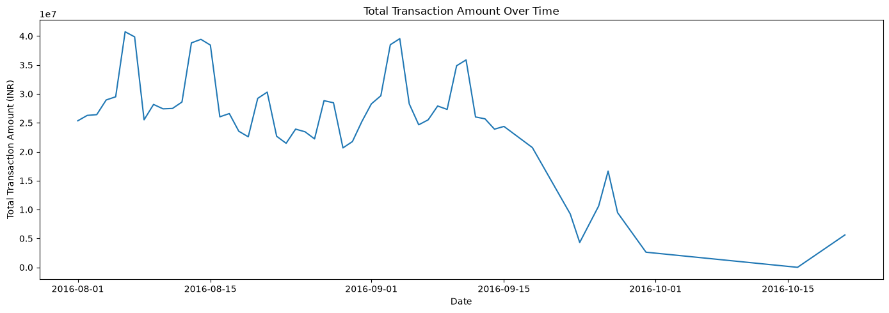
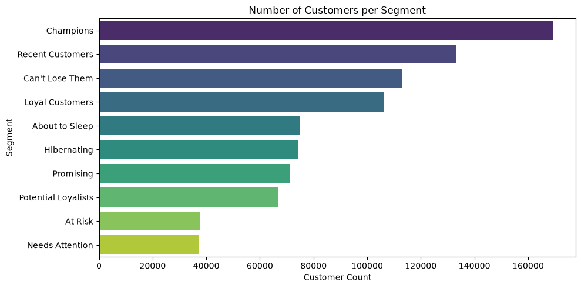
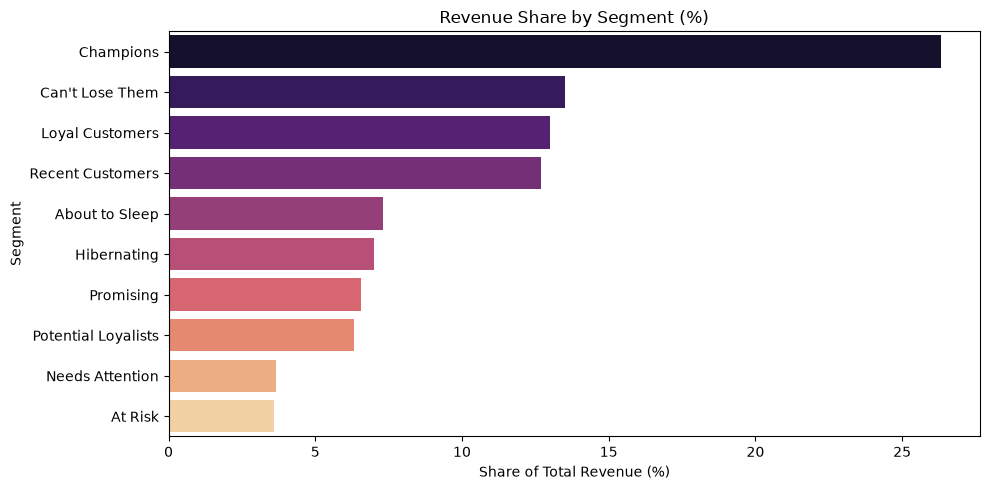
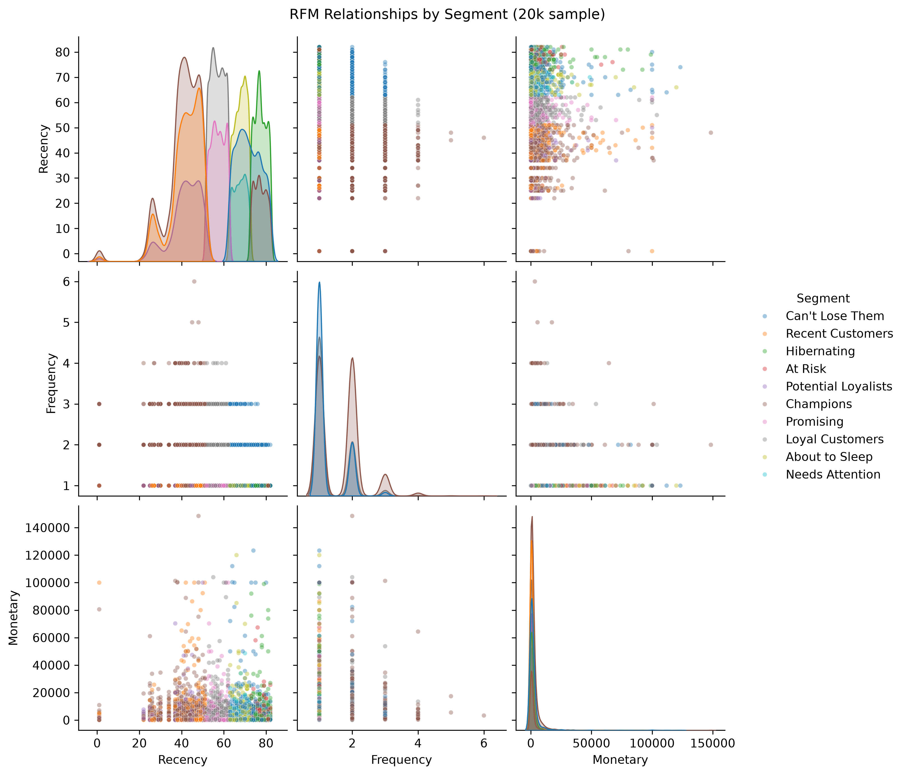
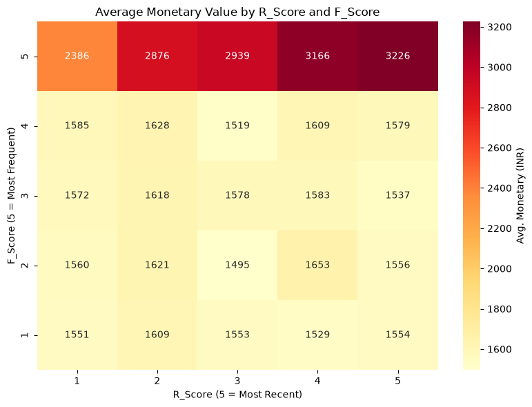

# RFM Customer Segmentation — Bank Transactions

An end-to-end customer segmentation project using **RFM (Recency, Frequency, Monetary)** analysis on over **1 million real-world banking transactions**. The project identifies customer groups with different purchasing behaviors and translates analytical findings into actionable business insights.

---



---

# Overview

Customer segmentation is one of the most widely used techniques in CRM and marketing analytics. In this project, I perform a complete RFM analysis on a large-scale banking transaction dataset to identify meaningful customer groups based on their purchasing behavior.

The project covers the complete analytics workflow—from data cleaning and exploratory data analysis to feature engineering, customer segmentation, visualization, and business interpretation.

Rather than blindly applying standard RFM techniques, key preprocessing and segmentation decisions are evaluated against the characteristics of the dataset before implementation.

---

# Dataset

**Source**

https://www.kaggle.com/datasets/apoorvwatsky/bank-transaction-data

### Dataset Summary

- **Transactions:** ~1,048,000
- **Unique Customers:** ~880,000
- **Observation Period:** August–October 2016 (~2 months)

### Columns Used

- `CustomerID`
- `TransactionDate`
- `TransactionAmount (INR)`

> **Note:** Because the dataset covers only about two months, purchase frequency is naturally limited. Most customers completed only one transaction, making **Recency** the strongest behavioral indicator while **Frequency** provides relatively limited variation.

---

# Tools

- Python
- pandas
- NumPy
- matplotlib
- seaborn

---

# Project Workflow

## 1. Exploratory Data Analysis

Performed an initial inspection of the dataset including:

- Dataset structure
- Data types
- Summary statistics
- Missing values
- Duplicate records
- Distribution analysis
- Transaction trends over time
- Outlier detection

### RFM Distributions



The distributions reveal several important characteristics of the dataset:

- Recency values are concentrated between approximately 35–80 days.
- Frequency ranges only from 1 to 6 transactions, with most customers purchasing only once.
- Monetary values are highly right-skewed with a small number of extremely large transactions.

These observations explain why Frequency contributes relatively little information during segmentation.

---

## 2. Data Preprocessing

Performed data cleaning specifically for RFM analysis.

- Removed rows with missing values in RFM-critical columns
- Converted transaction dates to datetime format
- Checked for duplicate transactions
- Removed columns not required for customer segmentation:
  - CustomerDOB
  - CustAccountBalance
  - TransactionTime

---

## 3. Outlier Analysis

Transaction amounts exhibit a highly right-skewed distribution with several extreme values.



To better visualize the distribution, **99th-percentile capping** was applied.



The capped histogram improves readability while preserving the overall distribution.

> **Important:** Outlier capping was performed **only for visualization purposes.** The original transaction values were retained for all RFM calculations to preserve customers' true monetary value.

### Transaction Trend Before Capping



### Transaction Trend After Capping



Although capping reduces the magnitude of extreme spikes, the overall transaction trend remains unchanged.

---

## 4. Feature Engineering (RFM)

Customer-level RFM metrics were calculated using vectorized pandas operations.

- **Recency:** Days since the customer's last transaction
- **Frequency:** Total number of transactions
- **Monetary:** Total transaction amount

A snapshot date was defined as one day after the latest transaction to ensure consistent Recency calculation across all customers.

---

## 5. Customer Segmentation

Customers received:

- **Recency Score (1–5)**
- **Frequency Score (1–5)**

using quintiles.

Because the dataset spans only two months and Frequency has limited variation, customer segments were intentionally created using **Recency** and **Frequency** only.

The resulting score combinations were mapped into ten business-oriented customer segments using a predefined lookup table.

Monetary was intentionally excluded from segmentation and instead used as an independent validation metric.

---

## 6. Segment Analysis

Customer segments were evaluated using:

- Customer count
- Revenue contribution
- Average Monetary value
- Behavioral interpretation

---

# Customer Distribution by Segment



Champions represent the largest customer segment, followed by Recent Customers and Can't Lose Them.

---

# Revenue Contribution by Segment



Although Champions represent only about one-fifth of customers, they generate more than one-quarter of total revenue.

This indicates that the segmentation successfully captures meaningful differences in customer value.

---

# Segment Profile Dashboard


The dashboard summarizes the average Recency, Frequency, and Monetary values for each customer segment.

Key observations include:

- Champions have the highest average Monetary value and purchase frequency.
- Can't Lose Them customers remain high-value despite lower recency.
- Loyal Customers continue to generate strong spending.
- Recent Customers exhibit excellent recency but relatively low purchase frequency.
- At Risk and Hibernating customers show the weakest recency.

---

# RFM Relationships



The pairplot illustrates the distribution and overlap of customer segments across the three RFM dimensions.

Although Monetary was not used to define the segments, customers with stronger Recency and Frequency characteristics generally exhibit higher spending.

---

# Monetary Validation



Monetary was intentionally excluded from the segmentation process.

Instead, it was used afterward as an independent validation metric.

The heatmap shows that:

- Average Monetary remains relatively stable for Frequency scores below 5.
- Customers with the highest Frequency score spend substantially more.
- The highest average Monetary value occurs in the **R=5, F=5** group (Champions).

This independently validates that the segmentation successfully identifies economically valuable customers.

---

# Key Business Insights

- Champions generate the largest share of total revenue.
- Can't Lose Them customers represent the highest-priority retention opportunity.
- Most customers completed only a single transaction during the observation period.
- Spending increases substantially only among the most active customers.
- Recent Customers represent a valuable opportunity for conversion into Loyal Customers.

---

# Limitations

- The dataset covers only approximately two months.
- Frequency ranges only from 1 to 6 transactions, limiting its discriminative power.
- Customer segmentation is based only on Recency and Frequency.
- Monetary is used for validation rather than segmentation.
- Results may differ when applied to datasets with longer observation periods.

---

# Project Structure

```text
.
├── data/
│   └── bank_transactions.csv (It should be manually added due to size of the file)
│
├── output/
│   ├── avg_monetary_by_r_and_f.png
│   ├── boxplot.png
│   ├── capping_histogram.png
│   ├── customers_per_segment.png
│   ├── rfm_distributions.png
│   ├── rfm_pairplot.png
│   ├── segment_profiles_dashboard.png
│   ├── share_by_segment.png
│   ├── transaction_over_time2.png
│   └── transaction_over_time_after.png
│
├── rfm_analysis.ipynb
├── requirements.txt
└── README.md
```

---

# Skills Demonstrated

- Data Cleaning & Preprocessing
- Exploratory Data Analysis (EDA)
- Feature Engineering
- Customer Analytics
- RFM Customer Segmentation
- Business Insight Generation
- Data Visualization
- pandas
- NumPy
- matplotlib
- seaborn

---

# How to Run

```bash
pip install -r requirements.txt
jupyter notebook rfm_analysis.ipynb
```

Place `bank_transactions.csv` inside the `data/` directory and run the notebook from top to bottom to reproduce all visualizations.

---

# Future Improvements

- Customer Lifetime Value (CLV)
- Churn Prediction
- Interactive Streamlit Dashboard
- Campaign Performance Analysis
- Marketing ROI Analysis

---

# Conclusion

This project demonstrates an end-to-end customer analytics workflow using RFM analysis on more than one million banking transactions. It combines data cleaning, exploratory analysis, feature engineering, customer segmentation, visualization, and business interpretation to transform raw transaction data into meaningful customer insights.
